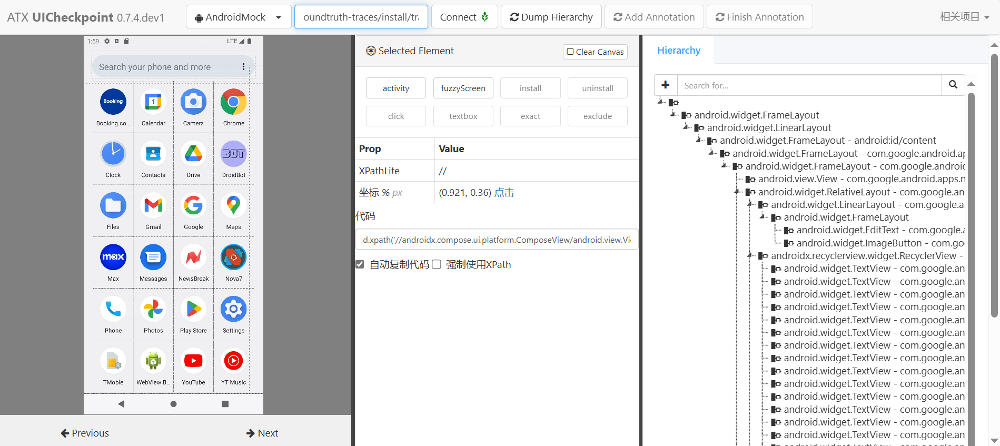

# UICheckpoint

UICheckpoint is part of the [Llamatouch](https://github.com/LlamaTouch) project and serves as a tool for task-standard process annotation of UI checkpoints. This tool is based on modifications made to the [Weditor](https://github.com/alibaba/web-editor), and we acknowledge and appreciate their contributions.

## Installation

Follow these steps to set up your environment:

1. Clone the repository:
   ```
   git clone https://github.com/xianqingjia777/UICheckpoint.git
   ```

2. Create a Conda environment:
   ```
   conda create -n UICheckpoint python=3.10
   ```

3. Activate the Conda environment:
   ```
   conda activate UICheckpoint
   ```

4. Install the project in editable mode using pip:
   ```
   pip3 install -e UICheckpoint
   ```

## Usage

Navigate to the project directory and start the editor:

1. Change directory to UICheckpoint:
   ```
   cd UICheckpoint
   ```

2. Start the editor module:
   ```
   python -m weditor
   ```

## How to Annotate

The UI interface appears as shown below :


### Annotation Steps:

1. **Enter the Trace Address**: This refers to the absolute path of the standard process folder(you can get standard process folder through this [tool](https://github.com/MATestbed/ws-scrcpy)) you wish to annotate. Enter this path in the designated input field and click 'Connect'.
   
2. The middle section contains supported annotation keywords. Their meanings are presented in the table below:

   | Keyword       | Match Type      | Description                                                  |
   |---------------|-----------------|--------------------------------------------------------------|
   | `activity`    | Exact           | Annotate the current screen's corresponding activity.        |
   | `fuzzyScreen` | Fuzzy           | Perform a fuzzy match based on the whole UI.                 |
   | `install`     | Exact           | Exact match for installation. Requires entering the corresponding app and selecting any component. |
   | `uninstall`   | Exact           | Exact match for uninstallation. Requires entering the corresponding app and selecting any component. |
   | `click`       | Exact           | Match a click action on the currently selected component.    |
   | `textbox`     | Fuzzy           | Check if the text of the selected component is semantically consistent. |
   | `exact`       | Exact           | Match the current state of the selected component, including the status of buttons and similarity of images. |
   | `exclude`     | Exact           | Ensure that the selected component is not present.           |

3. After selecting the appropriate keyword for the current component, click the 'Add Annotation' button.
4. Once the annotation of the current interface is complete, click the 'Finish Annotation' button to move to the next screen.

### Annotation Results:
The corresponding `.ess` file will be added to the original directory, which contains all the annotation information for this interface.